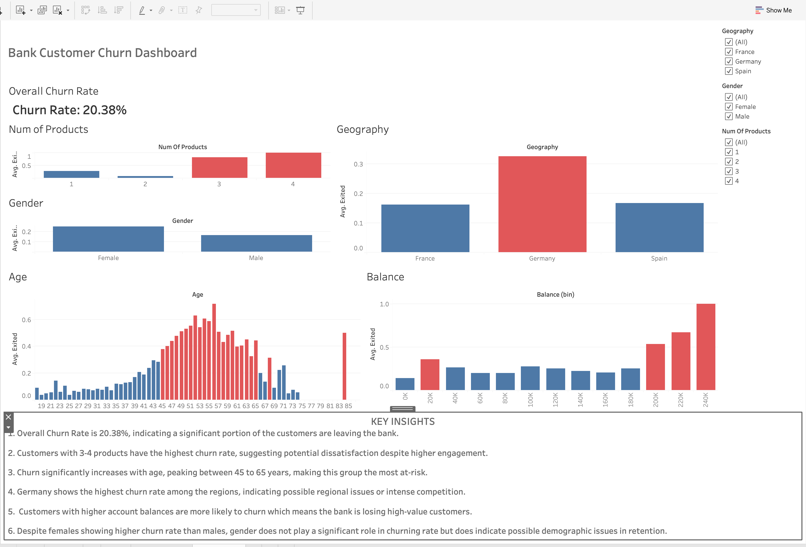

Live Dashboard: [View Here](https://public.tableau.com/app/profile/asfa.feeroze/viz/BankCustomerChurnDashboard_17739172593260/Dashboard1?publish=yes)

## 📊 Bank Customer Churn Analysis Dashboard

This project analyzes customer churn behavior using a banking dataset to identify key factors influencing customer retention.

## 🔍 Objectives

* Understand patterns behind customer churn

* Identify high-risk customer segments

* Provide data-driven recommendations

## 📈 Key Insights

* Overall churn rate is 20.38%

* Customers aged 45–65 are most likely to churn

* Customers with higher balances churn more

* Germany has the highest churn rate

* Customers with multiple products show unexpected churn

## 💡 Recommendations

* Target high-balance customers with retention offers

* Focus on customers aged 45–65

* Investigate churn drivers in Germany

* Improve engagement strategies

## 🛠️ Tools Used

* Tableau Public
* Data Visualization
* Data Analysis with Python 3.10

